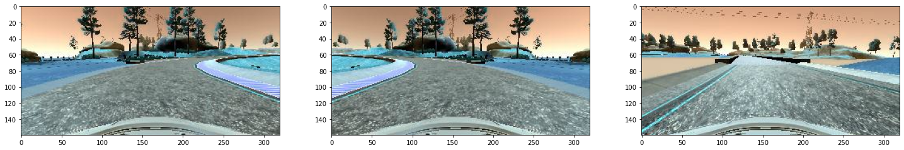

# Method

## Data for Model Training

An important aspect of the model training is to have sufficient data. Without a good variety of data, the model will not be able to perform well in a variety of situations that the vehicle may find itself in.

There were approximately 3 runs of the course as well as additional runs of difficult turns and course corrections (returning to middle of the road when straying to the shoulder of the road.

### Data Generation

Since we are limited by the amount of data already collected, we can generate more data by tweaking the images (and targets/steering values) to produce more data.

The data will be then be produced by an image generator for training and validation to make it easier for the model to train with the available computing resources.

#### Flipping images

We can add more variety to the data set by flipping the image. We adjust the target

#### Using off-center images

Since the simulated car has three cameras mounted on the left, center, and right, we can use the off-center camera images as templates of driving too far left and right. This involved modifying the target values by $\pm 0.25$. This allows more variety of course correcting situations to an overall smooth-driving training set.

#### Translate images

Translating images allows us to use simulate how to correct when the car is going off the middle of the track. We randomly translated images left and right randomly up to 50 pixels. We also correct the target values to represent this adjustment. The target value was adjusted according to how much translation.

#### Filtering Data

We noticed that many of the steering angles were small and slightly negative (straight driving and slight left turning respectively). To avoid this bias in the model, we randomly removed steering between $-0.010$ and $0.005$ $30\%$ of the time.

### Final Data

Below are three random images that are representative of the training, validation, and testing sets:

## Model Architecture

## Training

# Results

## Model Evaluation